# Install R and RStudio for (Mac) OSX

## R
  1. go to cran.r-project.org
  2. click on "Download R for (Mac) OS X" 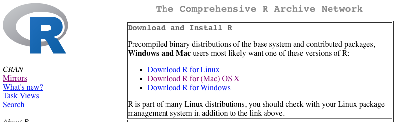
  3. choose the most recent version of the one fits your OSX
  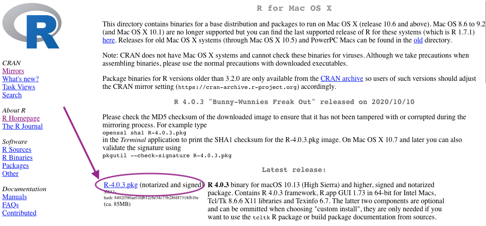
  4. go through installation process
  
  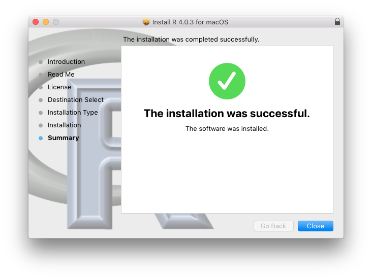
  5. locate R in applications folder 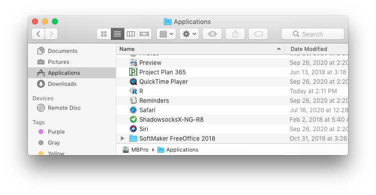
  6. open R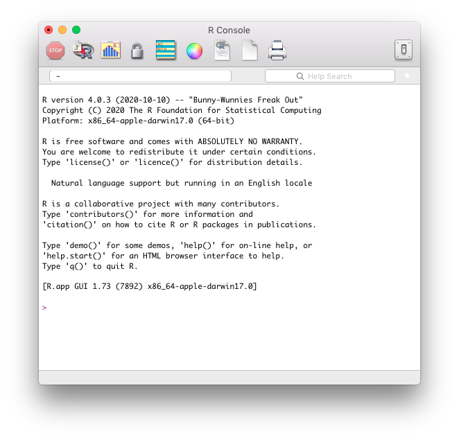

## RStudio
  1. go to rstudio.com
  2. under products, select RStudio 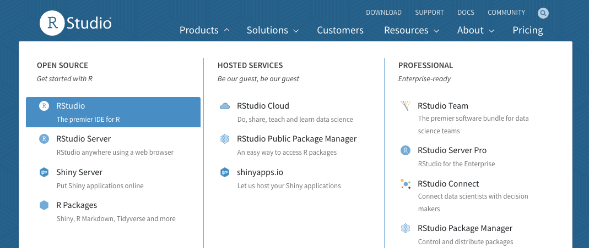
  3. choose RStudio Desktop 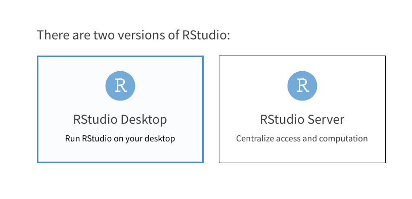
  4. choose opensource edition 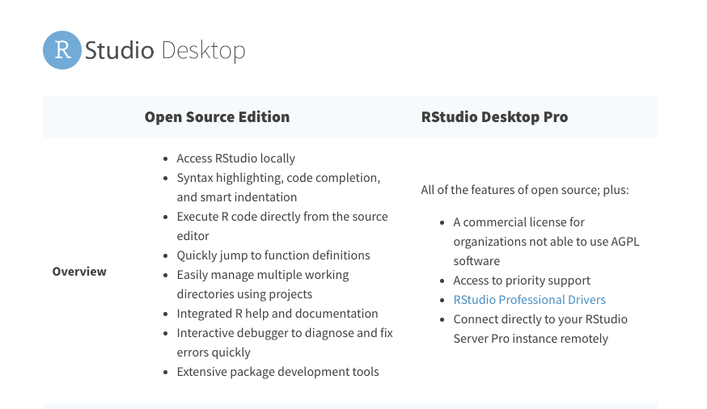
  5. download the free version 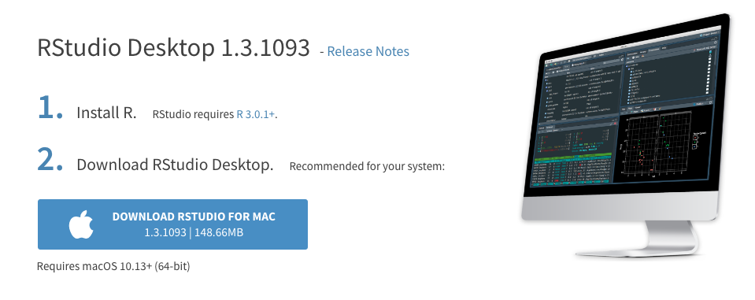
  6. open dmg, drag RStudio in Applications folder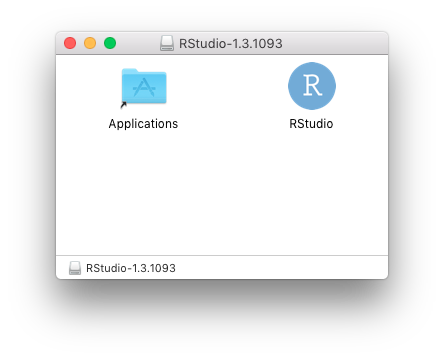
  7. locate RStudio in Applications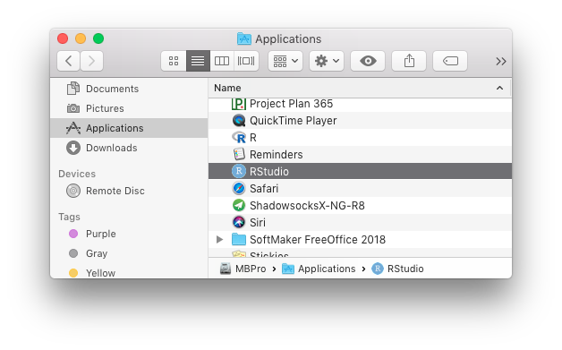
  8. open RStudio, and you are ready to roll! 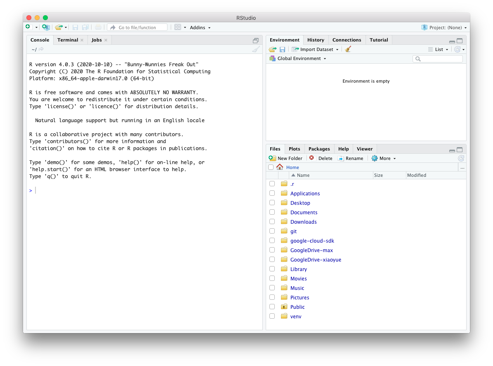
